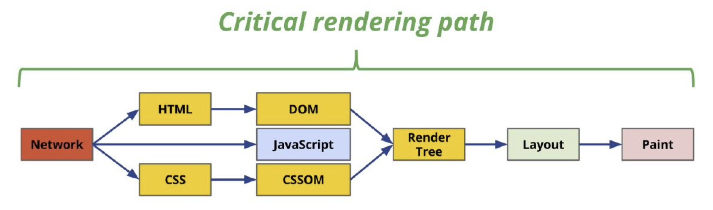
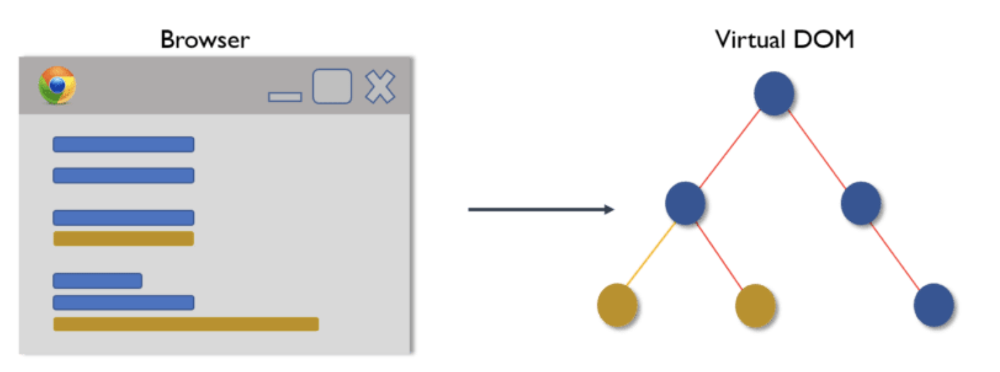
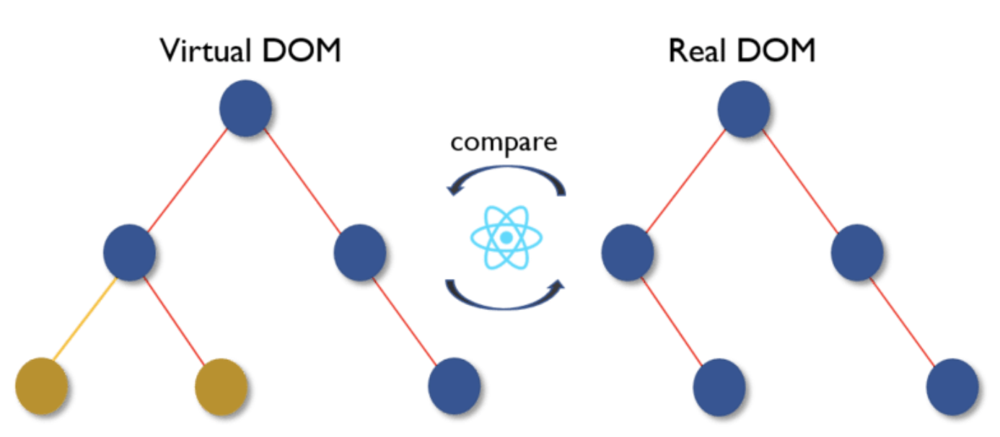
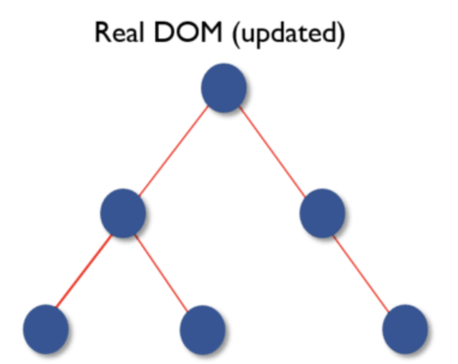

Para entender **¿Qué es el React.DOM?** y **¿Cómo funciona el React.DOM?** es necesario hablar primero del [**Critial Rendering Path**](https://guillermo.at/browser-critical-render-path)

El **Critial Rendering Path** es un proceso qué los navegadores hacen para qué el código que nosotros le enviemos (HTML, CSS y JS) se convierta en pixeles en las pantallas de nuestros usuarios.

De todo el proceso critico de renderizado, nos intereza solamente el DOM.

# 1. ¿Qué es el DOM?
- El **DOM** significa: Document Object Model - Modelo de objetos de documento
- El **DOM** es una representación gráfica de un diagrama de árbol de nodos basado en el documento HTML de nuestra aplicación web.
- El **DOM** es un modelo que puede ser modificado

# 2. ¿Qué es el DOM Virtual?

- El **DOM virtual** es una representación en memoria del **DOM real.**
- La representación de una interfaz de usuario se guarda en la memoria y se sincroniza con el DOM "real". Es un paso que ocurre entre la función de renderizado que se llama y la visualización de elementos en la pantalla. Todo este proceso se llama **reconciliación**.

## 2.1 ¿Qué es la reconciliación?

Cuando las *Props* o el estado de un componente cambian, React decide si es necesaria una actualización del DOM real comparando el elemento recién devuelto con el renderizado anteriormente. Cuando no son iguales, React actualizará el DOM. Este proceso se llama reconciliación.

# 3. ¿Cómo funciona el DOM Virtual?

El DOM Virtual funciona en 3 pasos:

1. Siempre que cambia cualquier dato subyacente, toda la interfaz de usuario se vuelve a representar en la representación del DOM virtual.

2. Luego se calcula la diferencia entre la representación DOM anterior y la nueva. (Algoritmo de diferenciación)

3. Una vez que se realizan los cálculos, el DOM real se actualizará solo con las cosas que realmente han cambiado.

# 3. ¿Cual es la diferencia entre el Virtual DOM y el Shadow DOM?

Shadow DOM es una tecnología de navegador diseñada principalmente para determinar el alcance de variables y CSS en componentes web. El DOM virtual es un concepto implementado por bibliotecas en JavaScript además de las API del navegador.

# RESUMEN
- Las manipulaciones frecuentes de DOM son caras.
- El DOM virtual es una representación virtual del DOM en la memoria.
- El DOM virtual se sincroniza con el DOM real con la biblioteca ReactDOM. Este proceso se llama Reconciliación.
- React compara el DOM virtual y el DOM virtual actualizado previamente y solo marca el subárbol de componentes que se actualizan. Este proceso se llama diferenciación.
- El algoritmo detrás de la diferenciación se llama algoritmo de diferenciación.
- React usa claves para evitar re-renderizaciones innecesarias.