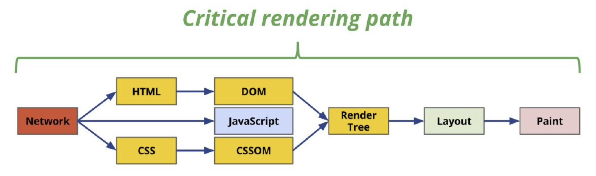

Para entender **¿Qué es el React.DOM?** y **¿Cómo funciona el React.DOM?** es necesario hablar primero del [**Critial Rendering Path**](https://guillermo.at/browser-critical-render-path)

El **Critial Rendering Path** es un proceso qué los navegadores hacen para qué el código que nosotros le enviemos (HTML, CSS y JS) se convierta en pixeles en las pantallas de nuestros usuarios.

De todo el proceso critico de renderizado, nos intereza solamente el DOM.

# 1. ¿Qué es el DOM?
- El DOM significa: Document Object Model - Modelo de objetos de documento
- El DOM es una representación gráfica de un diagrama de árbol de nodos basado en el documento HTML de nuestra aplicación web.
- El DOM es un modelo que puede ser modificado

# 2. ¿Qué es el DOM Virtual?

- El **DOM Virtual** es una copia ligera del **DOM "Real"** 
- El **DOM Virtual** se guarda en memoria
- El **DOM Virtual** actua como intermediario entre:
  - Los estados de la aplicación
  - Los estados de DOM vistos por el usuario (UI)

# 3. ¿Cómo funciona el DOM Virtual?

El **DOM virtual** tiene las mismas propiedades que el **DOM real**, pero carece del poder del objeto real para cambiar directamente lo que está en la pantalla, por eso, cuando ocurre un cambio en la aplicación web, React.js compara el **DOM virtual** con una **instantánea del DOM virtual tomada justo antes de la actualización del DOM virtual**.

Con la ayuda de esta comparación, React descubre qué componentes de la interfaz de usuario deben actualizarse. Este proceso se llama diferenciación. 

> El algoritmo que se utiliza para el proceso de diferenciación se denomina algoritmo de diferenciación.

Una vez que React.js sabe qué componentes se han actualizado, reemplaza los nodos DOM originales con el nodo DOM actualizado.

> El proceso de mantener la sincronización entre el **DOM** y el **Virtual DOM** se llama ***Reconciliación***

# RESUMEN
- Las manipulaciones frecuentes de DOM son caras.
- El DOM virtual es una representación virtual del DOM en la memoria.
- El DOM virtual se sincroniza con el DOM real con la biblioteca ReactDOM. Este proceso se llama Reconciliación.
- React compara el DOM virtual y el DOM virtual actualizado previamente y solo marca el subárbol de componentes que se actualizan. Este proceso se llama diferenciación.
- El algoritmo detrás de la diferenciación se llama algoritmo de diferenciación.
- React usa claves para evitar re-renderizaciones innecesarias.