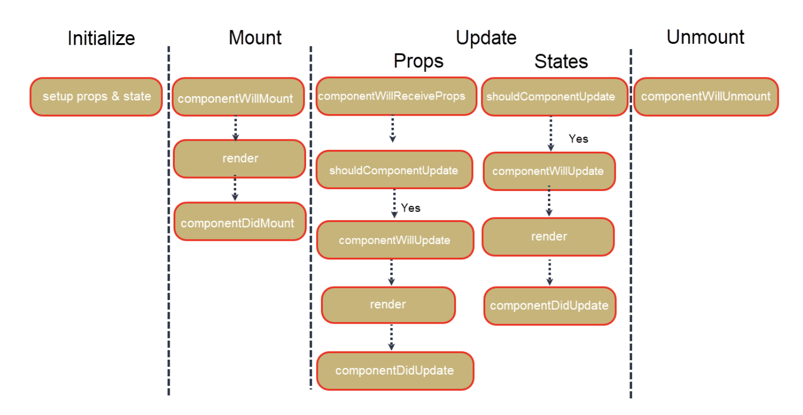
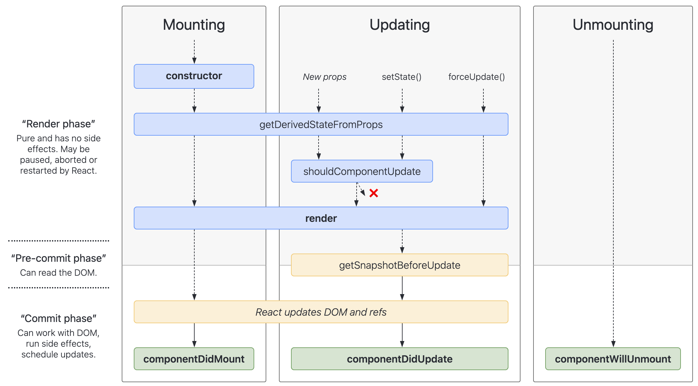

[Ciclo de vida en React.js](https://medium.com/swlh/understanding-component-lifecycle-in-reactjs-ed35d76dab2e)

- Todo lo que se ve en una applicación hecha con React.js es un componente o hace parte de un componente.
- En react.js los componentes son diseñados para que sigan un ciclo de vida natural:
  - Los componentes **nacen (creación)**
  - Los componentes **crecer (Actualización)**
  - Los componentes **mueren (Eliminación)**

Para cada fase de la vida de un componente, React proporciona acceso a ciertos eventos/métodos integrados llamados:
- **Enlaces de ciclo de vida - *lifecycle hooks***
- **Métodos de ciclo de vida -  *lifecycle methods***

Estos métodos le brindan oportunidades para controlar y manipular cómo reacciona un componente a los cambios en la aplicación.

# 0. Montaje-previo(Inicialización) / Pre-mounting (Initialization)

Un componente de tipo clase tiene una función constructora que se llama para configurar las cosas. Por lo general, configura el estado y los Props.

# 1. Montaje / Mounting
Una vez que se ha completado la inicialización, se crea una instancia del componente y se monta en el DOM. Utilizando su estado inicial, el componente se representa en la página por primera vez. En esta fase, tenemos dos métodos de ciclo de vida disponibles para usar: 
- `componentWillMount()`
- `componentDidMount()`

Una vez que se llama al constructor, se llama a `componentWillMount()` justo antes de renderizar y se llama una vez en un ciclo de vida. Este método no se usa mucho, incluso la documentación de React menciona que cualquier cosa que pueda hacer aquí se hace mejor con los `métodos constructor` o `componentDidMount()`.

Se llama a `componentDidMount()` justo después del método render. Al igual que `componentWillMount()`, se llama una vez en un ciclo de vida. Debido a que el método render ya ha sido llamado, podemos acceder al DOM. Utilizaría este método para configurar cualquier proceso de ejecución prolongada o procesos asincrónicos, como la obtención y actualización de datos.

# 2. Actualizacion/Updating

Siempre que el estado y los Props de un componente cambian desde el componente React o a través de la API o el backend, el componente se actualiza volviéndose a renderizar en la página. El estado y los Props cambian según la interacción del usuario con el componente o si se pasan nuevos datos.

Los métodos de ciclo de vida que están disponibles en esta fase son:

1. **componentWillReceiveProps:** 
    - Este método se invoca cuando hay un cambio en los accesorios que el padre está pasando al componente. 
2. **shouldComponentUpdate:** 
    - Este método se invoca justo antes de que el componente esté a punto de volver a renderizarse.
    - Determina si el componente debe actualizarse o no.
    - De forma predeterminada, devuelve verdadero.
    - Puede comparar los Props y el estado antiguos y nuevos mediante el uso de los argumentos `nextProps()` y `nextState()` y evitar nuevas representaciones innecesarias si los cambios en los Props y/o el estado no afectan lo que se muestra al usuario.
 3. **componentWillUpdate:** 
    - Este método se llama justo después de que `shouldComponentUpdate` haya finalizado y justo antes de que se procese el nuevo componente.
    - Algunos ejemplos de usos de este método son:
      - Si tiene algún cálculo que deba realizar antes de volver a renderizar y después de los Props y/o actualizaciones de estado.
      - Si necesita actualizar integraciones con bibliotecas de terceros.
    - Al igual que `shouldComponentUpdate`, también recibe argumentos como `nextProps` y `nextState`.

4. **componentDidUpdate:**  
- Este método se llama justo después de volver a renderizar el componente.
- Tendrá acceso a los Props y el estado anteriores con `prevProp` y `prevState`, así como a los actuales.
- Puede usar este método para actualizar las bibliotecas de terceros si necesitan una actualización debido a la re-renderización.

# 3. Desmontaje/UnMounting

Esta es la última fase del ciclo de vida del componente. En la etapa de desmontaje, el componente se elimina y se elimina de la página. **El único método del ciclo de vida en esta etapa es `componentWillUnmount`**, que se llama justo antes de que se elimine el componente. Se utiliza para borrar todo lo que se configuró en `componentDidMount`.

## Imagen resumen de los métodos disponibles en cada fase del ciclo de vida de un compoente:

[Diagrama de métodos del ciclo de vida en React.js:](https://projects.wojtekmaj.pl/react-lifecycle-methods-diagram/)

# Resumen

Comprender el ciclo de vida del componente le permitirá realizar determinadas acciones cuando se crea, actualiza o destruye un componente. No es necesario utilizar todos los métodos en todos los componentes que cree. Los beneficios de usarlos es la oportunidad de decidir si un componente debe actualizarse en primer lugar y reaccionar a los accesorios o cambios de estado en consecuencia.